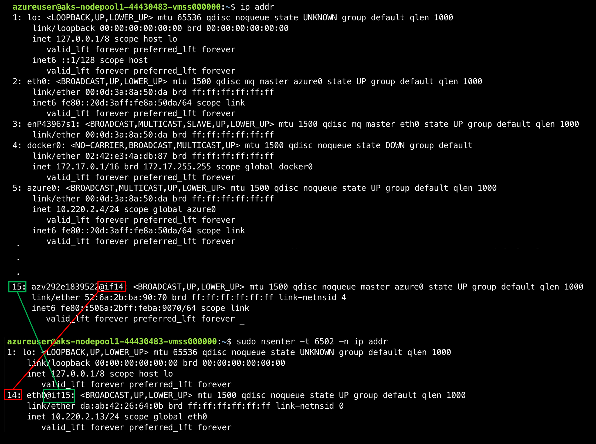
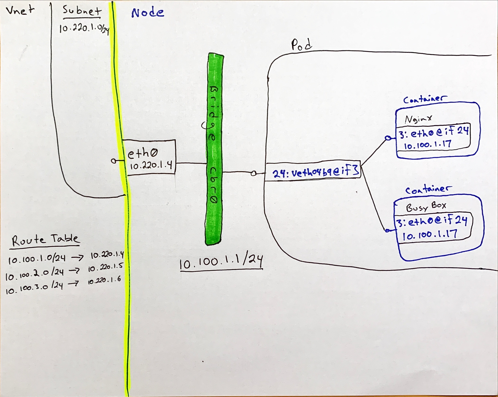

# AKS Networking Overview - Part 2: Azure CNI

## Setup
We've been through the [kubenet implementation](./part1-kubenet.md), and now we're on to Azure CNI. Lets start by creating an Azure CNI based AKS cluster. We've already created the Vnet and Subnets, so all we need to do is create the cluster.

Notice a few changes in the 'az aks create' command below.

* Cluster name to 'azurecni-cluster'
* Network Plugin to 'azure'
* Removed the '--pod-cidr' flag, as pods will be attached to the subnet directly

### Create the Kubenet AKS Cluster
```bash
# We'll re-use the RG and LOC, so lets set those
RG=NetworkLab
LOC=eastus

# Get the Azure CNI Subnet ID
AZURECNI_SUBNET_ID=$(az network vnet show -g $RG -n aksvnet -o tsv --query "subnets[?name=='azurecni'].id")

######################################
# Create the Azure CNI AKS Cluster
# Note: We set a service cidr
# and dns service ip for demonstration
# purposes, however these are optional
#######################################
az aks create \
-g $RG \
-n azurecni-cluster \
--network-plugin azure \
--vnet-subnet-id $AZURECNI_SUBNET_ID \
--service-cidr "10.200.0.0/16" \
--dns-service-ip "10.200.0.10" \
--enable-managed-identity

# Get Credentials
az aks get-credentials -g $RG -n azurecni-cluster

# Deploy 3 Nginx Pods across 3 nodes
kubectl apply -f nginx.yaml

# View the Services and pods
kubectl get svc
kubectl get pods -o wide --sort-by=.spec.nodeName # Sorted by node name
```

### Pod and Service CIDR behavior

Notice from your get svc and pods calls that, while the service ip addresses are from the service cidr we provided in cluster creation, the pods have IP addresses from the subnet cidr.

```bash
# Subnet CIDR from network creation
AZURECNI_AKS_CIDR="10.220.2.0/24"

# CIDR Values from 'az aks create'
--service-cidr "10.200.0.0/16"
```

Fig. 1


As we did with kubenet, to dig a bit deeper, lets ssh into the node and explore the network configuration. Again, we'll use [ssh-jump](https://github.com/yokawasa/kubectl-plugin-ssh-jump/blob/master/README.md). Don't forget that you need to [set up ssh access](https://docs.microsoft.com/en-us/azure/aks/ssh) first.

```bash
# Get a node name and ssh-jump to it
# Make sure you jump to a node where one of your nginx pods is running
kubectl get nodes
NAME                                STATUS   ROLES   AGE   VERSION
aks-nodepool1-44430483-vmss000000   Ready    agent   90m   v1.17.11
aks-nodepool1-44430483-vmss000001   Ready    agent   90m   v1.17.11
aks-nodepool1-44430483-vmss000002   Ready    agent   90m   v1.17.11

kubectl ssh-jump aks-nodepool1-44430483-vmss000000

# Get the docker id for the nginx pod
docker ps|grep nginx
8bdb2bd78165        nginx                                          "/docker-entrypoint.…"   26 minutes ago      Up 26 minutes                           k8s_nginx_nginx-7cf567cc7-5pvnj_default_56899928-244b-485e-846b-5302430a0c45_0
1f840366a5ea        mcr.microsoft.com/oss/kubernetes/pause:1.3.1   "/pause"                 26 minutes ago      Up 26 minutes                           k8s_POD_nginx-7cf567cc7-5pvnj_default_56899928-244b-485e-846b-5302430a0c45_0
```

So far, all the same as when we tested with kubenet. We have two containers because of the /pause container we mentioned in part 1. Now lets dig into the newtork stack.

```bash
# Get the pid for your container
docker inspect --format '{{ .State.Pid }}' 8bdb2bd78165
6502

# List the network interfaces for the pid
sudo nsenter -t 6502 -n ip addr
1: lo: <LOOPBACK,UP,LOWER_UP> mtu 65536 qdisc noqueue state UNKNOWN group default qlen 1000
    link/loopback 00:00:00:00:00:00 brd 00:00:00:00:00:00
    inet 127.0.0.1/8 scope host lo
       valid_lft forever preferred_lft forever
14: eth0@if15: <BROADCAST,UP,LOWER_UP> mtu 1500 qdisc noqueue state UP group default qlen 1000
    link/ether da:ab:42:26:64:0b brd ff:ff:ff:ff:ff:ff link-netnsid 0
    inet 10.220.2.13/24 scope global eth0
       valid_lft forever preferred_lft forever
```

Ok, so this all look familiar as well. We have an eth0@if15. This interface has an IP address from our Azure CNI subnet. Now lets look at the host interfaces to see what we have going on there. Yup....looks the same as kubenet...mostly. We have an interface indexed at 14 named eth0@if15 in the container linked to an interface indexed at 15 on the host named azv292e1839522@if14....but that isnt a veth, so we need to dig a bit more.

Fig 2.



Ok, so now we know how each container is connected to the a virtual ethernet interface on the host, but where does it get it's IP and how does it communicate out of the node? Our first hint is the 'cbr0' name listed in the 'ip addr' output for our veth.  Checking out the Kubernetes docs on [Kubenet](https://kubernetes.io/docs/concepts/extend-kubernetes/compute-storage-net/network-plugins/#kubenet), we know that cbr0 is the bridge network created and managed by kubenet. We can see the interface in our 'ip addr' output. Also notice that the inet value for cbr0 is 10.100.1.1/24, which happens to be our pod cidr! So cbr0 is the bridge network that the veth links are joined to. We can confirm this by using the brctl command from bridge-utils. Notice all of our veth interfaces attached to cbr0.

```bash
# Install the bridge-utils package
sudo apt update
sudo apt install bridge-utils

# Show the bridge networks on the server
brctl show
bridge name bridge id          STP enabled  interfaces
cbr0        8000.160c0cac5660  no           veth9423965c
                                            vetha1065ff2
                                            vetha33f314e
                                            vethcd3ab008
                                            vethd3b9c108
```

Further, if we look at the routes defined on our machine we can see that any traffic destined for our pod cidr should be sent to that cbr0 bridge interface, and the traffic leaving our cbr0 bridge should go to the default route (0.0.0.0)...which uses eth0 and points to our network gateway address (10.220.1.1).

```bash
# Get Routes
route -n
Kernel IP routing table
Destination     Gateway         Genmask         Flags Metric Ref    Use Iface
0.0.0.0         10.220.1.1      0.0.0.0         UG    0      0        0 eth0
10.100.1.0      0.0.0.0         255.255.255.0   U     0      0        0 cbr0
10.220.1.0      0.0.0.0         255.255.255.0   U     0      0        0 eth0
168.63.129.16   10.220.1.1      255.255.255.255 UGH   0      0        0 eth0
169.254.169.254 10.220.1.1      255.255.255.255 UGH   0      0        0 eth0
172.17.0.0      0.0.0.0         255.255.0.0     U     0      0        0 docker0
```

FINALLY, the bridge network has brought us to the NIC of our Azure node (eth0). So, now we have the network wiring in place to get packets from outside of our node to a given container, within a pod, and the wiring to get traffic out of a container and pod out through the node network interface card. There's more to cover as our packet traverses that path, in particular how Kubernetes uses iptables to direct traffic flow, but lets hold off on how iptables come into play until after we look at Azure CNI so we can compare how the Kubenet and CNI wiring differ.

We still haven't seen how traffic from a container in one pod can reach a container in a pod on another node. This is one of the fundamental ways that Azure Kubernetes Service with the kubenet plugin differs from AKS with Azure CNI. Node to node traffic is directed by an Azure Route table. Before we look at the route table, one thing to know is that traffic between pods does not go through SNAT (Source NAT). That means that when a pod sends traffic to another pod, it retains it's pod ip.

**Note:** I know I said we'd cover iptables later, but just fyi...this is the set of rules that ensure packets originating from our pod cidr dont get SNAT'd to the node IP address. Notice the !10.100.0.0/16 for destination, meaning 'NOT 10.100.0.0/16' aka 'NOT our pod cidr'.

```bash
# Run iptables for the 'nat' table pulling the POSTROUTING chain...and do some formatting to make more pretty
iptables -t nat -nL POSTROUTING --line-numbers
Chain POSTROUTING (policy ACCEPT)
num  target     prot opt source               destination
1    KUBE-POSTROUTING  all  --  0.0.0.0/0            0.0.0.0/0            /* kubernetes postrouting rules */
2    MASQUERADE  all  --  172.17.0.0/16        0.0.0.0/0
3    MASQUERADE  all  --  0.0.0.0/0           !10.100.0.0/16        /* kubenet: SNAT for outbound traffic from cluster */ ADDRTYPE match dst-type !LOCAL
```

### Azure Route Table

When traffic is leaving our node it can be destined for:

1. Another network
1. A node in our current network
1. A pod in a node in our current network

For 1 & 2, we already saw above that our pod traffic will SNAT to the node IP address and will just go on their way along to their destination. For 3, however, the AKS kubenet implementation has an Azure Route Table that takes over. This route table it what tells Azure what node to route that pod traffic to. When nodes are added to an AKS kubenet cluster, the pod cidr is split into a /24 for each node. 


As you can see below, any traffic destined to pods in the 10.100.1.0/24 cidr will next hop to 10.220.1.4. Sure enough, if I look at the pods on that 

```bash
# Get nodes to see ips
kubectl get nodes -o wide
NAME                                STATUS   ROLES   AGE     VERSION    INTERNAL-IP   EXTERNAL-IP   OS-IMAGE             KERNEL-VERSION      CONTAINER-RUNTIME
aks-nodepool1-27511634-vmss000000   Ready    agent   5d23h   v1.17.11   10.220.1.4    <none>        Ubuntu 16.04.7 LTS   4.15.0-1096-azure   docker://19.3.12
aks-nodepool1-27511634-vmss000001   Ready    agent   5d23h   v1.17.11   10.220.1.5    <none>        Ubuntu 16.04.7 LTS   4.15.0-1096-azure   docker://19.3.12
aks-nodepool1-27511634-vmss000002   Ready    agent   5d23h   v1.17.11   10.220.1.6    <none>        Ubuntu 16.04.7 LTS   4.15.0-1096-azure   docker://19.3.12

# Get pods for the node with ip 10.220.1.4 (aks-nodepool1-27511634-vmss000000)
kubectl get pods --all-namespaces -o wide --field-selector spec.nodeName=aks-nodepool1-27511634-vmss000000
NAMESPACE     NAME                                         READY   STATUS    RESTARTS   AGE     IP            NODE                                NOMINATED NODE   READINESS GATES
default       nginx-7cf567cc7-bnvk9                        1/1     Running   0          34m     10.100.1.18   aks-nodepool1-27511634-vmss000000   <none>           <none>
kube-system   coredns-869cb84759-vdh55                     1/1     Running   0          5d23h   10.100.1.5    aks-nodepool1-27511634-vmss000000   <none>           <none>
kube-system   coredns-autoscaler-5b867494f-25vlb           1/1     Running   5          6d      10.100.1.3    aks-nodepool1-27511634-vmss000000   <none>           <none>
kube-system   dashboard-metrics-scraper-5ddb5bf5c8-ph4vs   1/1     Running   0          6d      10.100.1.4    aks-nodepool1-27511634-vmss000000   <none>           <none>
kube-system   kube-proxy-2n62m                             1/1     Running   0          5d23h   10.220.1.4    aks-nodepool1-27511634-vmss000000   <none>           <none>
```

**Note:** Ignore the kube-proxy pod above, which has an ip of 10.220.1.4, which is the node ip. If you take a look at the definition of that pod you'll see that it attaches to the host network (*kubectl get pod kube-proxy-2n62m -n kube-system -o yaml|grep hostNetwork*)

### Next

Now that we have a good idea of how kubenet works in AKS, lets have a look at Azure CNI


### Big Picture

Fig 3.


## References
* [Understanding Azure Kubernetes Service
Basic Networking](https://azuregulfblog.files.wordpress.com/2019/04/aks_basicnetwork_technicalpaper.pdf)